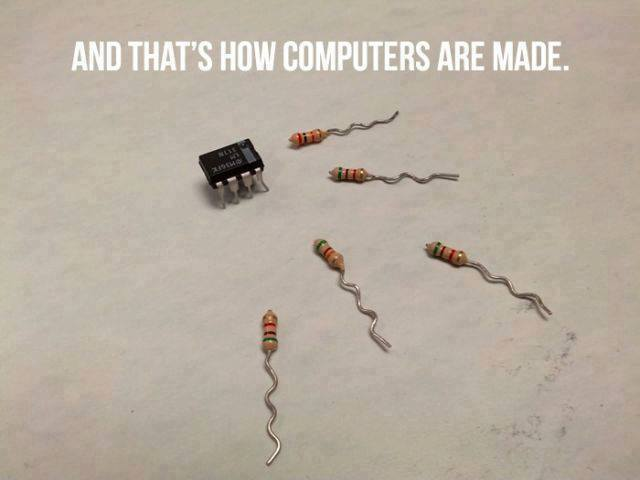

Bury
========================

     ,ggggggggggg,   ,ggg,         gg  ,ggggggggggg,    ,ggg,         gg
    dP"""88""""""Y8,dP""Y8a        88 dP"""88""""""Y8, dP""Y8a        88
    Yb,  88      `8bYb, `88        88 Yb,  88      `8b Yb, `88        88
     `"  88      ,8P `"  88        88  `"  88      ,8P  `"  88        88
         88aaaad8P"      88        88      88aaaad8P"       88        88
         88""""Y8ba      88        88      88""""Yb,        88        88
         88      `8b     88        88      88     "8b       88       ,88
         88      ,8P     88        88      88      `8i      Y8b,___,d888
         88_____,d8'     Y8b,____,d88,     88       Yb,      "Y88888P"88,
        88888888P"        "Y888888P"Y8     88        Y8           ,ad8888
                                                                 d8P" 88
                                                               ,d8'   88
                                                               d8'    88
                                                               88     88
                                                               Y8,_ _,88
                                                                "Y888P"

A nodejs port of [BuriedUnderTheNoiseFloor](https://github.com/jspark311/BuriedUnderTheNoiseFloor).

Write up is at my [blog](http://www.joshianlindsay.com/index.php?id=126).

If anyone is feeling generous, my bitcoin address is *17da1aqXEhdqMkbEq66nc2n5DeAnrnNbsK*. Donations help me justify spending time on my computer to my wife. :-)

Comments and issues posted on github will be answered. Pull-requests are always welcome if you've fixed or enhanced something.

--------

### Installation

    git clone https://github.com/jspark311/node-bury.git
    cd node-bury
    npm install

### Usage
##### Encrypting
    var Bury = require('bury');

    var options = {
      enableRed:      true,
      enableGreen:    true,
      enableBlue:     true,
      compress:       false,
      visibleResult:  false,
      rescaleCarrier: true,
      storeFilename:  false
    };

    var test_image = new Bury('./test_carrier.jpg', 'saddroPs', options);

    var msg = 'This is a silly test message that the NSA will spend millions of dollars to unearth.'
    test_image.setMessage(msg);
    test_image.outputImage('./test_carrier.png');

##### Decrypting
    var Bury = require('bury');

    var test_readback = new Bury('./test_carrier.png', 'saddroPs');
    console.log(test_readback.getMessage());

##### Testing passwords for mutual compatibility
    var Bury = require('bury');

    // testPasswordCompatibility() returns 'true' if the provided passwords are mutually compatible.
    //   'false' otherwise. The function requires at least two passwords. Maximum of three, because we
    //   can only have (at maximum) three independent channels.

    console.log('Are these passwords compatible? ' + 
      Bury.testPasswordCompatibility('key_for_steg-img.php', 'key_for_form.php'));

    console.log('Are these passwords compatible? ' + 
      Bury.testPasswordCompatibility('one-of-thess-passwords', 'is-not-mutally', 'compatible'));

### Compatibility note

The carriers produced by this code will not inter-operate with those produced with the PHP version, and vice-versa. The *only* reason for this is that the default PRNG in PHP was able to be seeded, and the one in node is not. This might not be a problem, as I at least had enough foresight to bake a version field into the header in the original. So I have incremented this value for the JS code.

This problem may be resolvable by changing the PHP code to use the same mersenne twister algorithm used here. But I doubt that this is going to cause anyone enough grief to care.

Just sayin'...

### TODO
  * Compression is broken at the moment.

  * File-embedding is untested.

  * The control-flow that this code inherited from the PHP original feels awful in JS. There are too many synchronous operations and arbitrary branching. Need to impart a more functional style to it.

  * There is presently no enforcement of "one instance, one operation". Risks obtuse crypto bugs caused by crufty IVs and seeded RNGs from prior operations.

  * It would be nice to be able to automatically write output files if such-and-such an option parameter is passed in at instantiation. The same goes for encrypting.

  * Decrypting can (in principle) be done automatically, as with nothing more than the carrier and a password, a header can be discovered and the data retrieved. But, at present, you must make a separate function call.

  * The PHP version was intended for use on a webserver, and therefore file-output was not the first priority. Here, the situation is reversed, and output files are the only thing I've tested. Still need to test some of the direct-output functions so that the results of encrypting can be served immediately to a web browser without having to pass through an intermediary file beforehand.

  * Write unit tests. Should be easy to do, since the criteria for success is unambiguous.

-------------

-------------

License is MIT, so be free.

---J. Ian Lindsay
